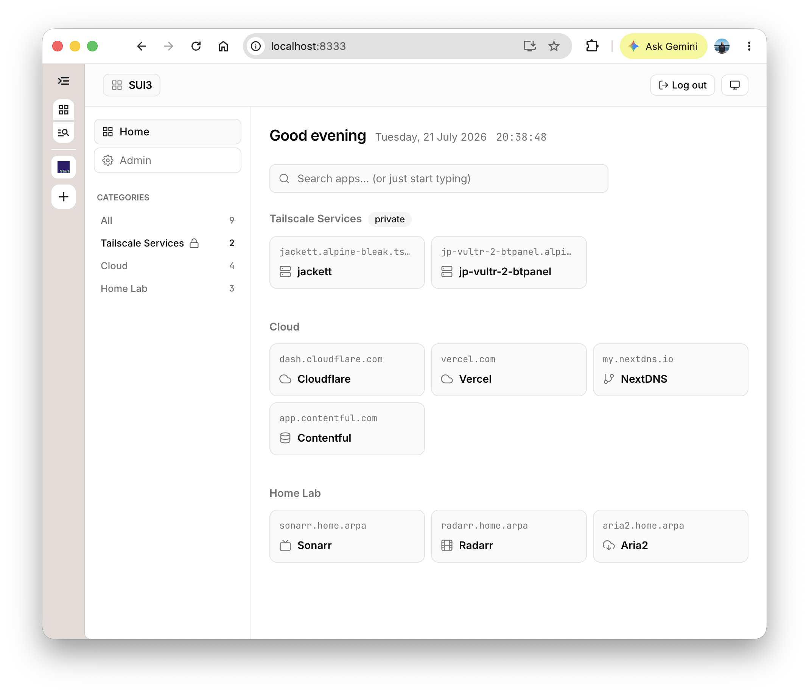

# SUI3

[English](./README.md) | [中文](./README.zh-CN.md)

基于 TanStack Start、Cloudflare Workers 和 D1 的单用户个人起始页。

## 主要特性



1. Passkey 快捷登录
2. 旧 SUI2 快速迁移
3. 支持显示 Tailscale 服务入口

## Fork 并部署你自己的实例

1. **在 GitHub 上 Fork 本仓库。**

2. **创建 D1 数据库**

   ```bash
   wrangler d1 create sui3
   ```

   记录返回的 `database_id`。

3. **配置仓库 Secrets**

   在 **Settings → Secrets and variables → Actions** 下添加：

   | Secret | 用途 |
   | --- | --- |
   | `CLOUDFLARE_API_TOKEN` | 具有 **Cloudflare Workers Admin**、**D1 Edit** 和 **Zone Edit** 权限的 API token |
   | `CLOUDFLARE_ACCOUNT_ID` | 你的 Cloudflare 账户 ID |
   | `SUI3_DOMAIN_PRODUCTION` | 自定义域名，例如 `start.example.com` |
   | `SUI3_D1_DATABASE_ID_PRODUCTION` | 第 2 步得到的 `database_id` |

4. **推送到 `master` 分支**

   仓库内置的 GitHub Actions 工作流会在每次推送时自动生成
   `wrangler.production.jsonc`、构建并部署到 Cloudflare Workers，同时应用
   D1 数据库迁移。

5. **配置 Worker 运行时变量**

   可以在 Cloudflare 控制台（**Workers & Pages → sui3 → Settings →
   Variables and Secrets**）中设置，或者在本地生成配置文件后使用
   Wrangler CLI：

   ```bash
   SUI3_DOMAIN_PRODUCTION=start.example.com \
   SUI3_D1_DATABASE_ID_PRODUCTION=<database_id> \
   node scripts/generate-wrangler-config.js production

   wrangler secret put SETUP_TOKEN --config wrangler.production.jsonc
   wrangler secret put CREDENTIAL_ENCRYPTION_KEY --config wrangler.production.jsonc
   wrangler secret put WEBAUTHN_RP_ID --config wrangler.production.jsonc
   wrangler secret put WEBAUTHN_ORIGIN --config wrangler.production.jsonc
   ```

   | 变量 | 示例 | 用途 |
   | --- | --- | --- |
   | `SETUP_TOKEN` | 随机字符串 | 一次性 Passkey 注册密钥 |
   | `CREDENTIAL_ENCRYPTION_KEY` | `openssl rand -base64 32` | 加密存储在 D1 中的集成凭据 |
   | `WEBAUTHN_RP_ID` | `start.example.com` | 必须与浏览器访问的主机名一致 |
   | `WEBAUTHN_ORIGIN` | `https://start.example.com` | WebAuthn 使用的源（Origin） |

   > `wrangler.production.jsonc` 由 `scripts/generate-wrangler-config.js`
   > 根据 Secrets 生成，已被 gitignore。基础 `wrangler.jsonc` 不包含任何
   > 账户相关的值，可以安全地提交到版本库。

## 初始化设置

1. 打开 `https://你的域名/setup`，输入 `SETUP_TOKEN` 并注册你的
   Passkey。此操作只能进行一次。
2. 打开 `/admin`，导入你的 sui2 `data.json`（仅应用；会覆盖所有现有
   分类和应用）。
3. 可选：如需启用 Tailscale Services，创建一个具有只读 `all:read`
   scope 的 Tailscale OAuth client，然后在 **Admin → Tailscale** 中输入
   其 client ID 和 client secret。SUI3 会从 Tailscale API 返回的内部设备
   FQDN 推导 tailnet 的 MagicDNS 后缀，并在每次同步时刷新。如果设置过程
   中发现失败，Admin 会显示可选的手动 DNS 备用配置项。

## 本地部署

```bash
pnpm install
pnpm db:migrate:local
pnpm dev
```

按需填写 `.dev.vars` 中的值：

- `SETUP_TOKEN` — 在 `/setup` 页面一次性使用
- `WEBAUTHN_RP_ID=localhost`
- `WEBAUTHN_ORIGIN=http://localhost:8333`
- `CREDENTIAL_ENCRYPTION_KEY` — 用于加密集成凭据的 base64 编码 32 字节密钥

使用 `openssl rand -base64 32` 生成本地加密密钥。重启之间请保持该值不
变，否则需要在 Admin 中重新输入 Tailscale 凭据。

1. 打开 http://localhost:8333/setup 并注册你的 Passkey
2. 打开 `/admin` 并导入你的 sui2 `data.json`

## 脚本

| 脚本 | 用途 |
| --- | --- |
| `pnpm dev` | 本地开发 |
| `pnpm build` | 使用开发环境的 Wrangler 绑定构建 |
| `pnpm build:production` | 使用 `wrangler.production.jsonc` 构建 |
| `pnpm deploy` | 生产构建 + Wrangler 部署 |
| `pnpm db:migrate:local` | 在本地应用 D1 迁移 |
| `pnpm db:migrate:remote` | 在远程应用 D1 迁移 |

架构与认证细节请参阅 [AGENTS.md](./AGENTS.md)。
